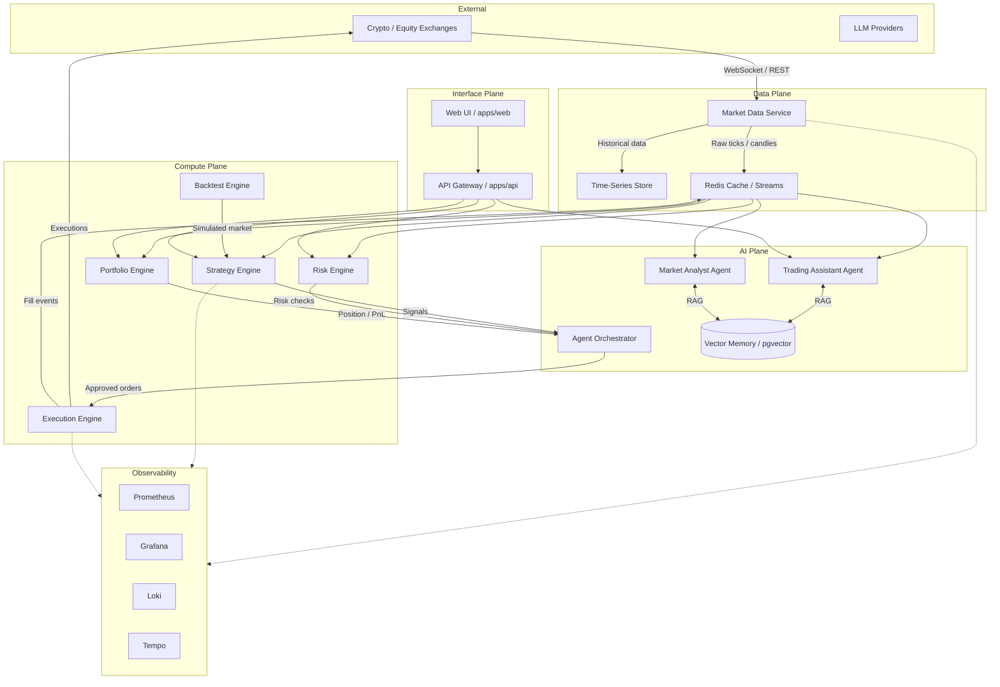

# Architecture Overview

## Status

Draft v0.1 — Initial foundation for the autonomous AI trading ecosystem.

## Vision

Build an autonomous AI trading ecosystem that can grow for years without a major redesign. The system is composed of intelligent agents, domain services, and infrastructure that communicate through events and well-defined contracts.

## Guiding Principles

1. **Clean Architecture**: Business logic is independent of frameworks, UI, and infrastructure.
2. **Domain Driven Design**: Code structure reflects domain concepts and bounded contexts.
3. **SOLID**: Small, focused modules with clear responsibilities.
4. **Event Driven Architecture**: Services communicate via durable events, not direct RPC.
5. **Microservice-ready modules**: Monorepo structure supports independent deployment when needed.
6. **Plugin Architecture**: Strategies, indicators, data sources, and risk rules are plugins.
7. **AI-first design**: Agents consume structured market events, not raw candles.
8. **Everything observable**: Metrics, logs, and traces are first-class concerns.
9. **Everything documented**: Decisions, APIs, and deployment steps are written down.
10. **Reproducible decisions**: Every major choice is captured in an ADR.

## High-Level Architecture



## Bounded Contexts

| Context | Responsibility | Primary Location |
|---|---|---|
| Market Data | Ingest, normalize, and stream market data from exchanges. | `services/market-data` |
| Strategy | Generate trading signals from indicators and price action. | `services/strategy` |
| Risk | Validate orders against limits, exposure, and drawdown rules. | `services/risk` |
| Portfolio | Track positions, PnL, allocation, and performance analytics. | `services/portfolio` |
| Execution | Send orders, handle fills, and manage order lifecycle. | `services/execution` |
| Backtest | Run historical simulations and report performance. | `services/backtest` |
| Trading Assistant | Conversational AI agent with market reasoning and memory. | `agents/trading-assistant` |
| Market Analyst | Automated market analysis and narrative generation. | `agents/market-analyst` |
| API Gateway | External API and WebSocket surface. | `apps/api` |
| Web UI | Operator dashboard and agent chat interface. | `apps/web` |

## Communication Patterns

- **Commands**: Synchronous requests when immediate feedback is required (e.g., place order, get balance).
- **Events**: Asynchronous, durable messages for everything else (e.g., `MarketTick`, `SignalGenerated`, `OrderFilled`, `RiskRejected`).
- **Queries**: Read-optimized endpoints backed by materialized views or time-series stores.
- **Agent Orchestration**: Directed by an orchestrator that routes events to the correct agent and manages memory.

## Technology Stack

| Layer | Technology | Rationale |
|---|---|---|
| Language | Python 3.12+ | Quant ecosystem, ML/AI libraries, strong typing. |
| API Framework | FastAPI | High performance, auto-generated OpenAPI, async-native. |
| Message Bus | Redis Streams / Apache Kafka (later) | Durable, ordered event streams; Redis chosen for early simplicity. |
| Cache | Redis | Low-latency state and pub/sub. |
| Database | PostgreSQL + pgvector | Relational data and vector memory in one store. |
| Time-Series | TimescaleDB or ClickHouse (later) | Efficient candle and tick storage. |
| LLM | OpenAI / Anthropic / Local via LiteLLM | Swap models without code changes. |
| Agent Framework | Custom orchestrator on top of PydanticAI / LangGraph patterns | Avoid lock-in; own the orchestration contract. |
| Container | Docker + Docker Compose | Local reproducibility; Kubernetes migration path. |
| Monitoring | Prometheus + Grafana + Loki + Tempo | Metrics, logs, and traces. |
| Testing | pytest, Hypothesis, Playwright | Unit, property-based, and E2E tests. |

## Package Structure

```text
/apps
  /api          # API Gateway (FastAPI)
  /web          # Web dashboard (React / Next.js later)
/services
  /market-data  # Ingestion and normalization
  /execution    # Order lifecycle and exchange adapters
  /strategy     # Signal generation and strategy plugins
  /risk         # Risk checks and limits
  /portfolio    # Position, PnL, and analytics
  /backtest     # Simulation engine
/agents
  /trading-assistant
  /market-analyst
/packages
  /shared-core  # Logging, config, events, messaging clients
  /domain-models # Pydantic models shared across services
/infrastructure
  /docker
  /terraform
  /k8s
/tests
  /unit
  /integration
  /e2e
/config
/scripts
/monitoring
/tools
/docs
```

## Data Flow

1. Market Data Service ingests ticks/candles from exchanges and publishes normalized events.
2. Strategy Engine subscribes to market events, applies indicators, and emits `SignalGenerated`.
3. Risk Engine validates the signal and emits `RiskValidated` or `RiskRejected`.
4. Portfolio Engine checks allocation and updates expected exposure.
5. Execution Engine receives approved orders, routes to exchanges, and emits `OrderFilled`.
6. Portfolio Engine updates positions and PnL on fills.
7. Trading Assistant consumes structured market events and reasoning context from memory to generate analysis.

## Security

- No secrets in code. Use environment variables and a secrets manager (Vault / AWS Secrets Manager).
- API authentication via JWT with short-lived tokens.
- Exchange keys are encrypted at rest and never logged.
- All inter-service communication over TLS in production.
- Input validation on every boundary using Pydantic models.

## Scalability

- Stateless services allow horizontal scaling.
- Redis Streams provide consumer groups for load-balanced event processing.
- Market data is sharded by symbol/exchange.
- Backtesting is horizontally partitionable by date range.

## Migration Path

1. **Phase 1**: Monorepo with Docker Compose. Services run as separate containers but share a network.
2. **Phase 2**: Extract services to independently deployable units when a boundary becomes a bottleneck.
3. **Phase 3**: Kubernetes orchestration with Helm charts and service mesh.
4. **Phase 4**: Multi-region deployment and disaster recovery.

## Decision Records

See [docs/decisions/](decisions/) for Architecture Decision Records (ADRs).
